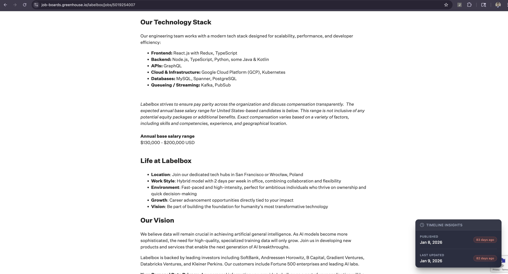
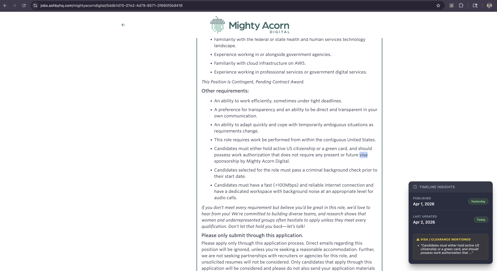

# 🕵️‍♂️ ATS Insight: Job Board Date Revealer

A lightweight, vanilla JavaScript Chrome Extension built for job seekers. It automatically scrapes hidden metadata from popular ATS platforms (Greenhouse, Ashby, Lever) to reveal exactly when a job was published, when it was last updated, and scans the description for hidden Visa or Clearance requirements.

Stop applying to "ghost jobs" that have been sitting untouched for 6 months, and stop wasting time on applications that don't support your visa requirements.

## ✨ Features

* **🕰️ Hidden Date Extraction:** Bypasses frontend UI to pull the actual `datePosted` and `updatedAt` timestamps directly from hidden JSON-LD scripts and API endpoints.
* **🚦 Smart Age Badges:** Automatically calculates how many days ago the job was posted and color-codes it (🟢 Fresh, 🟡 Warm, 🔴 Stale).
* **⚠️ Intelligent Visa/Clearance Scanner:** Uses RegEx to scan the job description for strict keywords (Sponsorship, H1B, OPT, Clearance, Citizen) and extracts the exact context sentence into a warning box.
* **🥷 Seamless UI:** Built with a dark-mode, glassmorphism design that floats cleanly over the page without causing CSS bleed.

## 🛠️ Supported Platforms
* ✅ **Greenhouse** (`boards.greenhouse.io`, `job-boards.greenhouse.io`)
* ✅ **Ashby** (`jobs.ashbyhq.com`)
* ✅ **Lever** (`jobs.lever.co`)
* ⏳ *More coming soon...*

## 📸 Screenshots

### Uncover Hidden Timelines

### Auto-Scan for Sponsorship & Clearance

## 🚀 How to Install (Developer Mode)

Since this is open-source and not currently on the Chrome Web Store, you can install it locally in seconds:

1. Clone or download this repository to your local machine.
2. Open Google Chrome and navigate to `chrome://extensions/`.
3. Toggle on **Developer mode** in the top right corner.
4. Click **Load unpacked** in the top left corner.
5. Select the folder containing this extension (`ATS-Insight-Extension`).
6. Navigate to any supported job board and watch the widget appear in the bottom right!

## 🤝 Contributing
Contributions are totally welcome! If you want to add support for Workday, iCIMS, or BambooHR, feel free to fork the repo and submit a PR.

## 📝 License
This project is open-source and available under the MIT License.