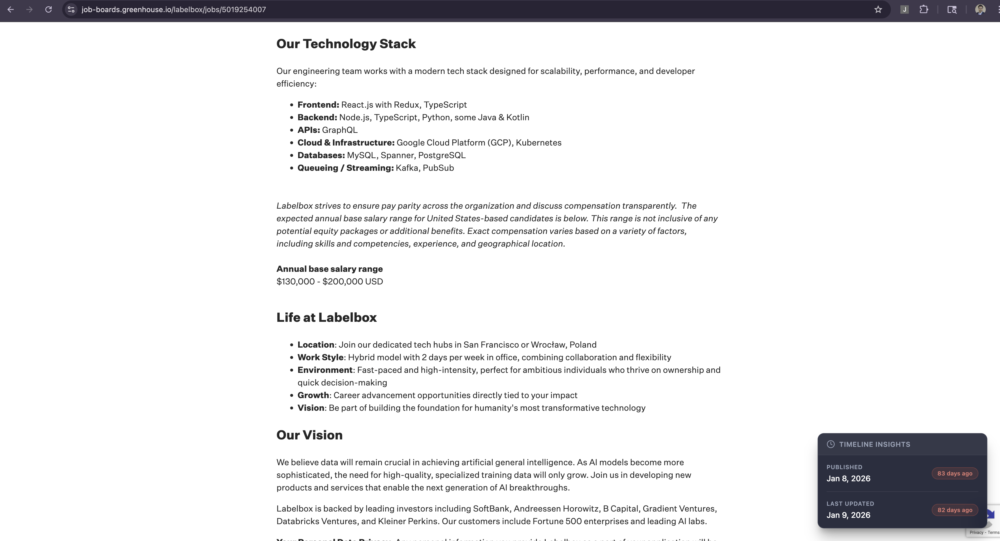
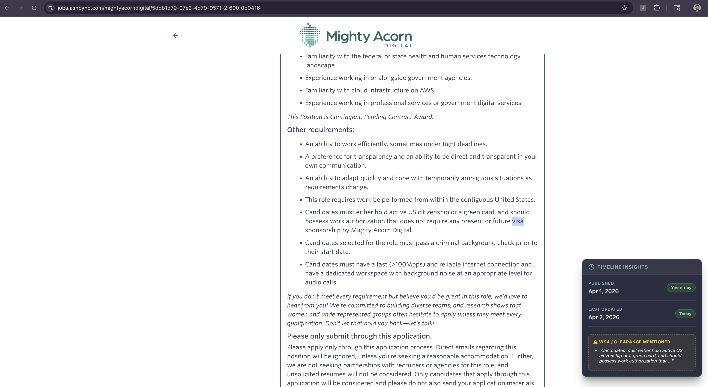

# 🕵️‍♂️ ATS Insight: Job Board Date Revealer

A lightweight, vanilla JavaScript Chrome Extension built for job seekers. It automatically scrapes hidden metadata from popular ATS platforms to reveal exactly when a job was published, when it was last updated, detects non-US roles, scans the description for Visa/Sponsorship signals, and provides a 1-click E-Verify status check.

Stop applying to "ghost jobs" that have been sitting untouched for 6 months, and stop wasting time on applications that don't support your visa requirements.

---

## 🆕 What's New in v1.4

* **4 New ATS Platforms** — Workday, BambooHR, SmartRecruiters, and Workable are now fully supported (see Supported Platforms).
* **📍 Non-US Role Detection** — A blue banner now appears when the job's structured data indicates a non-US location (UK, Canada, India, etc.), reminding you that E-Verify may not apply.
* **3-Tier Sponsorship Scanner** — The visa scanner now distinguishes between three states instead of a single yellow warning:
  * ✅ **Green — Sponsorship Available:** Detects explicit positive signals ("we sponsor", "visa sponsorship provided", etc.)
  * 🚫 **Red — Sponsorship Not Available:** Detects clear disqualifiers ("does not sponsor", "no visa sponsorship", "authorized to work without sponsorship", etc.)
  * ⚠️ **Yellow — General Mention:** Catches everything else (H-1B, OPT, clearance, green card) as an ambiguous signal.
* **Collapse / Expand Toggle** — A chevron button in the widget header lets you minimize it. State is remembered across page loads via `localStorage`.
* **Smarter Noise Filtering** — The visa scanner now strips JSON blobs, escaped unicode, and non-prose fragments before scanning, dramatically reducing false positives on Next.js / Workday pages.

---

## ✨ Features

* **🕰️ Hidden Date Extraction:** Bypasses frontend UI to pull the actual `datePosted` and `updatedAt` timestamps directly from hidden JSON-LD scripts, Next.js state data, and API endpoints.
* **🚦 Smart Age Badges:** Automatically calculates how many days ago the job was posted and color-codes it (🟢 Fresh, 🟡 Warm, 🔴 Stale).
* **📍 Non-US Role Detection:** Parses `jobLocation` from structured data (and Greenhouse's free-text location string) to flag international roles with a blue banner.
* **🛡️ 3-Tier Sponsorship Scanner:** Scans the job description with layered regex patterns to distinguish "sponsorship available", "no sponsorship", and general mentions — each shown in a distinct color.
  * **Smart Filtering:** Ignores EEO legal boilerplate, application form dropdowns, and raw JSON fragments to prevent false positives.
  * **DOM-Cloning Tech:** Creates an invisible clone of the page body and prunes `<form>` elements before scanning so only the actual job description is analyzed.
* **🏢 1-Click E-Verify Check:** Extracts the hiring company's name from structured data and generates a direct search link to the official USCIS E-Verify database.
* **📐 Collapsible Widget:** Minimize the widget with one click; position and state are preserved across page loads.
* **🥷 Seamless UI:** Dark-mode glassmorphism design that floats cleanly over any ATS page without CSS bleed.

## 🛠️ Supported Platforms
* ✅ **Greenhouse** (`boards.greenhouse.io`, `job-boards.greenhouse.io`)
* ✅ **Ashby** (`jobs.ashbyhq.com`)
* ✅ **Lever** (`jobs.lever.co`)
* ✅ **Workday** (`*.myworkdayjobs.com`) — *New in v1.4*
* ✅ **BambooHR** (`*.bamboohr.com`) — *New in v1.4*
* ✅ **SmartRecruiters** (`jobs.smartrecruiters.com`) — *New in v1.4*
* ✅ **Workable** (`apply.workable.com`) — *New in v1.4*

## 📸 Screenshots

### Uncover Hidden Timelines

### Auto-Scan for Sponsorship & Clearance

## 🚀 How to Install (Developer Mode)

Since this is open-source and not currently on the Chrome Web Store, you can install it locally in seconds:

1. Clone or download this repository to your local machine.
2. Open Google Chrome and navigate to `chrome://extensions/`.
3. Toggle on **Developer mode** in the top right corner.
4. Click **Load unpacked** in the top left corner.
5. Select the folder containing this extension (`ATS-Insight-Extension` or your specific folder name).
6. Navigate to any supported job board and watch the widget appear in the bottom right!

## 🤝 Contributing
Contributions are totally welcome! Feel free to fork the repo and submit a PR.

## 📝 License
This project is open-source and available under the MIT License.